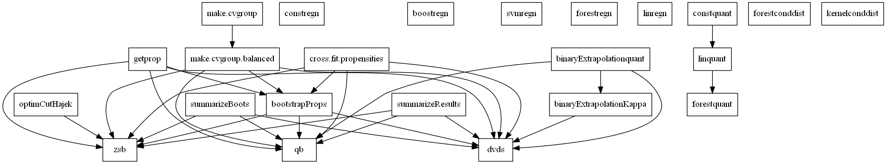

# DVDS
Package based on CausalML's [DoublyValidDoublySharpSensitivity](https://github.com/CausalML/DoublyValidDoublySharpSensitivity) repository of the replication code for [Dorn, Guo and Kallus (2024)](https://arxiv.org/abs/2112.11449).

## Maps

### `DVDS`

### `simplified_dvds.png`
